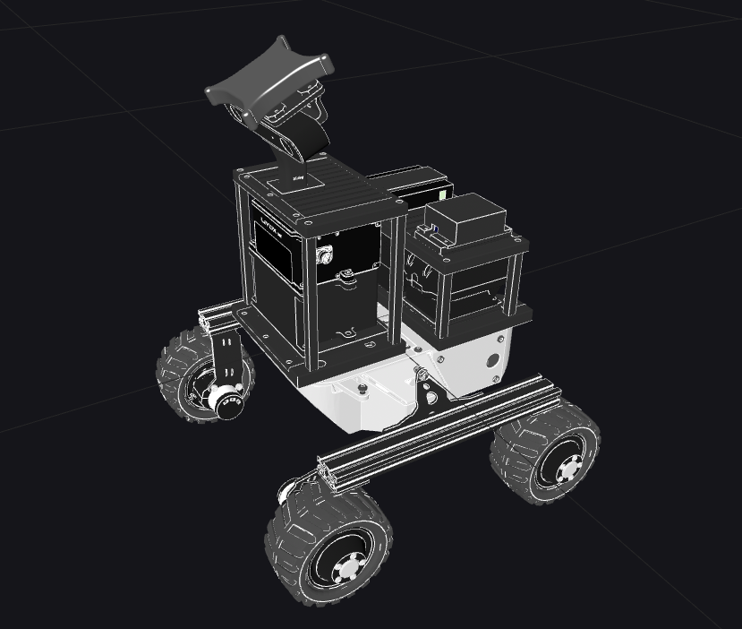

# leo_common 

Common ROS packages for Leo Rover that will work no matter on what machine they were run in the ROS network. Usable for both the real robot operation and the simulation.

* images - Images for this README document.
* [leo] - Metapackage for this repository.
* [leo_description] - Robot description (URDF model).
* [leo_msgs] - Message and Service definitions.
* [leo_teleop] - Scripts for robot's teleoperation.

Visit each package's ROS Wiki page for more information. \
For more information about the robot, visit [Robots/Leo Rover].

[leo]: http://wiki.ros.org/leo
[leo_description]: http://wiki.ros.org/leo_description
[leo_msgs]: http://wiki.ros.org/leo_msgs
[leo_teleop]: http://wiki.ros.org/leo_teleop
[Robots/Leo Rover]: http://wiki.ros.org/Robots/Leo%20Rover


The `leo_description` has been modified to match the design of Leo-01 (make sure to use the leo01 branch of this repository). The URDF file `leo.urdf.xacro` creates the following robot description.



The URDF can be published using the following command:

```bash
ros2 launch leo_description state_publisher.launch.xml
```


## Copy right notes for components from third parties

### Parts from Leo Rover
The files `leorover_description/models/model_extensions/xavier_mount.dae` and `leo_description/models/model_extensions/long_camera_mast.dae` have been taken respectively derived from the CAD model from the Leo Rover. To get the CAD model, see [https://www.leorover.tech](https://www.leorover.tech/documentation/specification).

### Parts from Stereolabs
The file `zed2_camera.dae` has been taken from the URDF model of the GitHub repository of the [zed-ros2-wrapper](https://github.com/stereolabs/zed-ros2-wrapper)

### Parts from Intel RealSense
The file `realsense_d455.dae` has been taken from the CAD model repositories of the website of [Intel RealSense](https://dev.intelrealsense.com/docs/stereo-depth-camera-d400)

### Parts for the Livox HAP LiDAR
The file `livox_hap_model.dae` has been taken from the "Documents & Manuals" section of the [Livoxtech](https://www.livoxtech.com/hap/downloads) website. The file used is based on the `HAP(TX）3D Model`.

### Parts for the battery mount
The mount for the makita battery has been taken from [ThingyVerse](https://www.thingiverse.com/thing:1857196) with the following notes:

- LICENSE.txt: This thing was created by Thingiverse user Henk_i3, and is licensed under Creative Commons - Attribution
- README.txt: Makita Battery Model with mounting screws by Henk_i3 on Thingiverse: https://www.thingiverse.com/thing:1857196